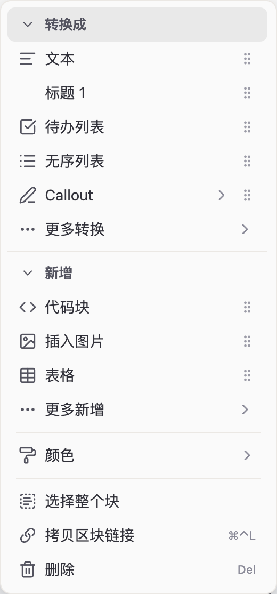
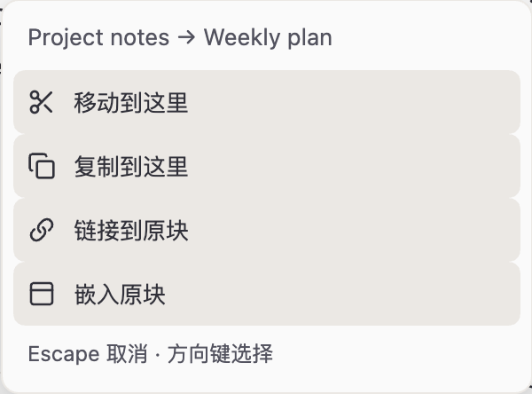

# Notion block for Obsidian

Edit, rearrange, and reuse Markdown blocks in Obsidian's Live Preview editor.

Open block actions from one `⠿` handle, organize lists and callouts by dragging, and reuse content across notes with move, copy, link, or embed.

**Requires Obsidian 1.8.7 or later on desktop. Works in Live Preview.**

- **Edit from one menu:** convert blocks, insert content, apply colors, and copy block links.
- **Rearrange with structure:** move paragraphs and list items, adjust nesting, and drop content into quotes or callouts.
- **Reuse across notes:** drag between open editing panes, then choose how the destination note should use the block.

[Install](#installation) · [Quick start](#quick-start) · [Features](#features) · [Settings](#settings) · [Limitations](#limitations) · [Changelog](CHANGELOG.md)

## Installation

### Community plugins

1. Open **Settings → Community plugins** and turn on community plugins if needed.
2. Select **Browse** and search for **Notion block**.
3. Select **Install**, then **Enable**.

You can also open the [Notion block community listing](https://community.obsidian.md/plugins/notion-block) and choose **Add to Obsidian**. See [Obsidian's installation guide](https://help.obsidian.md/Extending+Obsidian/Community+plugins) for more details.

### Manual installation

1. Download `main.js`, `manifest.json`, and `styles.css` from the [latest release](https://github.com/BCS1037/notion-block/releases/latest).
2. Create `<vault>/.obsidian/plugins/notion-block/` if it does not exist, and place the three files inside it.
3. Reload Obsidian, then enable **Notion block** in **Settings → Community plugins**.

## Quick start

1. Open a Markdown note in **Live Preview**.
2. Hover beside a line to reveal its `⠿` handle. The handle follows the line you point at, so you can act without moving the text cursor first.
3. Click `⠿` to open **Turn into** and **Add**, or hold it for **150 ms** to start dragging.
4. Drag to an insertion indicator and release to move content. Drag into another open note's editing pane to choose a cross-note action.

Select text first to move or convert that range. For an entire list, quote, or callout, choose **Select whole block** from the block menu or the handle's right-click menu.

## Features

### One handle for block actions

The block menu places **Turn into** above **Add** in one column. Both groups start expanded; you can collapse them independently, and each remembers its state.

| Group | Available content |
| --- | --- |
| **Turn into** | Text, headings H1–H3, bulleted and numbered lists, to-do lists, quotes, code blocks, math blocks, dividers, and 12 callout types |
| **Add** | Code blocks, math blocks, callouts, internal and external links, images, tables, today's date, current time, footnotes, and comments |
| **Block actions** | Text and background colors, select whole block, copy block link, and delete |

Block content is inserted below a nonempty line. Inline commands append to the targeted line. Focus returns to the editor after insertion, and edits remain undoable.

Customize which commands appear directly or under **More**, and drag their grips to change their order.

*A customized block menu. Screenshots show the Simplified Chinese interface.*

### Drag with Markdown structure

Reorder content using the handle and visible drop feedback:

- Move a list item together with its descendants. Drag right or left over a list to nest or outdent it.
- Drop content into a list, quote, or callout at the indicated position.
- Keep code blocks, tables, and math blocks together.

Dragging and **Turn into** use the same selection-first scope. With no selection, the scope follows the content under the handle:

| Content | Default scope |
| --- | --- |
| Plain text | Current paragraph |
| List | Current item and its descendants |
| Quote or callout body | Current Markdown source line |
| Callout title | Entire callout |
| Code block, table, or math block | Entire block |

Use **Select whole block** before dragging or converting a complete list, quote, or callout.

### Move, copy, link, or embed across notes

Open two notes side by side in the **same window and vault**. Drag a block from its handle into the other note's Markdown editing pane, then release to choose:

| Action | Result | Useful for |
| --- | --- | --- |
| **Move here** | Move content from the source note to the destination | Reorganizing notes |
| **Copy here** | Insert an independent copy in the destination | Reusing a starting point |
| **Link to original block** | Insert `[[note#^id]]` pointing to the source block | Referring back to the original |
| **Embed original block** | Insert `![[note#^id]]` to display the source block in the destination | Showing shared content in context |

Neither note changes until you choose an action. **Escape** or clicking outside cancels. Changing either note or closing its editor while the menu is open also cancels the transfer.

Links and embeds reuse existing block IDs or add missing IDs to the source. When Obsidian requires a complete native block, a partial paragraph, quote, or callout expands to that block; the menu explains the expansion. Multiple blocks keep their order.

Moving keeps block IDs. Copying creates fresh IDs and updates links between copied blocks. Wikilinks and inline Markdown links and images are adjusted for the destination note; attachment files stay in their original locations.

## Settings

Open **Settings → Notion block** to adjust:

| Setting | What it controls | Default |
| --- | --- | --- |
| **Menu commands** | Command placement under the main menu or **More**, and order within each group | All commands shown directly |
| **Button hover delay** | Delay before handles appear | 0 ms |
| **Button hide delay** | Delay before handles disappear | 200 ms |
| **Date format** | Format used when inserting today's date | `YYYY-MM-DD` |
| **Time format** | Format used when inserting the current time | `HH:mm` |

Command orders and placement are independent for **Turn into** and **Add**. Reorder commands in the popup or settings; changes save automatically. Each group can be reset to its defaults.

Keyboard controls:

- **Enter / Space** or **Left / Right** on a group heading collapses or expands it.
- **Back** or **Left** returns from **More**.
- **Alt + Up / Down** on a focused command grip changes its position.
- In the cross-note drop menu, use **Up / Down** to choose, **Enter** to confirm, and **Escape** to cancel.

The interface follows Obsidian's language and supports English, Simplified Chinese, and Traditional Chinese.

## Limitations

- **Platform:** the published plugin is desktop-only and designed for Live Preview.
- **Cross-note targets:** transfers require visible Markdown editing panes in the same window and vault. Separate windows, unopened tabs, and file-tree entries are not drop targets. Two panes showing the same file use ordinary within-note movement.
- **Undo and redo:** transfers coordinate changes in both notes. Keep both editors open. If the other note has later edits, undo those first before undoing the transfer with **Ctrl/Cmd + Z**.
- **Existing references:** moving a block with incoming block references is disabled. Use copy, link, or embed to keep those references working. Wait for Obsidian to finish indexing if a move is temporarily unavailable.
- **Block IDs:** conflicting IDs and unsupported block references are rejected. Blocks with separate block ID lines must be placed outside list and quote containers.

## Privacy

Notion block runs locally in your vault, makes no network requests, and sends no telemetry. Copying block links uses the clipboard. Checks for existing block references use local notes and Obsidian's link metadata.

## Support

[Report a bug or request a feature](https://github.com/BCS1037/notion-block/issues). For an interaction issue, include your Obsidian version, plugin version, and steps to reproduce it.

If this plugin helps you, consider supporting its development: [赞赏作者](https://ifdian.net/a/bcs1037).

## License

[MIT](LICENSE).
